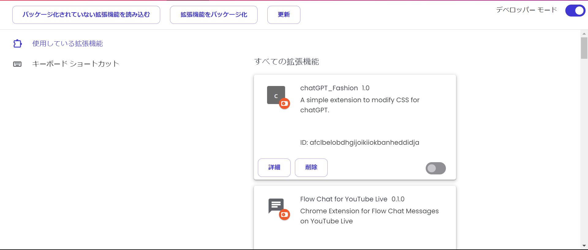
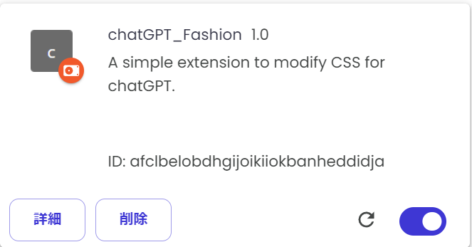

# chatGPT_Fashion

## installation

1. リポジトリをクローン

    ```powershell
    git clone https://github.com/syugeeeeeeeeeei/chatGPT_Fashion.git
    ```

2. ディレクトリに入る

    ```powershell
    cd chatGPT_Fashion
    ```

3. chrome拡張機能のbuild

    ```powershell
    bash -c "./build.sh"
    ```

    →`dist/chatGPT_Fashion`**ディレクトリが出来ていたら成功**

4. chrome拡張機能の登録

    chrome拡張機能マネージャーから、「**パッケージ化されていない拡張機能を読み込む**」を選択し、`dist/chatGPT_Fashion`を選択してインストール
    ※デベロッパーモードをONにする
    

## edit

- cssの変更は、`src/css/content.css`の編集で行う。
- 変更後は再び`bash -c "./build.sh"`を行ってdistの更新を行う。
- build後は更新ボタンを押せば再インストールする必要はないよ
    